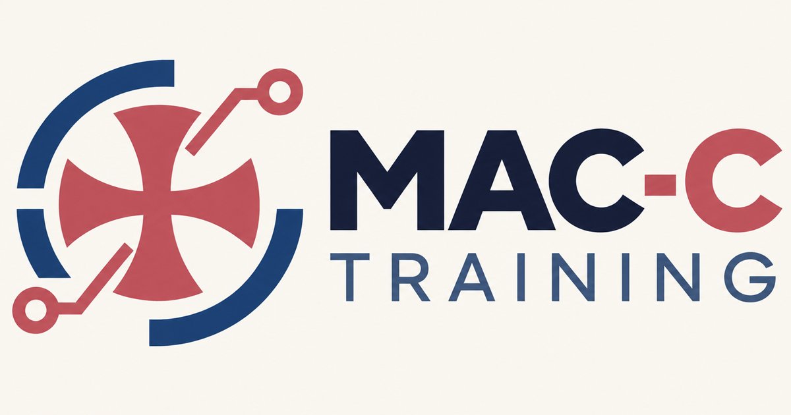

  
  
  **Formación Laboral Avanzada y Consultoría Tecnológica Especializada**
  
  
  
  
  

---

### 🚀 Sobre Nosotros

En **MAC-C Training** transformamos la capacitación técnica tradicional en habilidades laborales de aplicación inmediata. Diseñamos y ejecutamos soluciones de formación corporativa y consultoría de software aplicando metodologías activas y andragogía práctica (*hands-on*), asegurando una adopción tecnológica sin fricciones.

---

### 🛠️ Áreas de Especialización

<table>
  <tr>
    <td width="50%" valign="top">
      <h4>💻 Desarrollo de Software & Arquitectura</h4>
      <ul>
        <li>Ecosistemas modernos Frontend.</li>
        <li>Backend robusto y microservicios.</li>
        <li>Bases de datos relacionales, no relacionales y modelado de datos.</li>
      </ul>
    </td>
    <td width="50%" valign="top">
      <h4>📊 Datos, Pipelines & Cloud</h4>
      <ul>
        <li>Diseño de flujos de ingesta y pipelines ETL/ELT.</li>
        <li>Consolidación, limpieza y visualización interactiva de datos.</li>
        <li>Infraestructura Cloud y contenedores.</li>
      </ul>
    </td>
  </tr>
  <tr>
    <td width="50%" valign="top">
      <h4>⚙️ Automatización & CI/CD</h4>
      <ul>
        <li>Estrategias de control de versiones colaborativo con Git y GitHub.</li>
        <li>Pipelines automatizados de test y despliegue continuo con GitHub Actions.</li>
        <li>Scripts de automatización operativa, trazabilidad y manejo de errores.</li>
      </ul>
    </td>
    <td width="50%" valign="top">
      <h4>🤖 Inteligencia Artificial Aplicada</h4>
      <ul>
        <li>Integración práctica de LLMs y Agentes de IA en flujos productivos.</li>
        <li>Herramientas de adopción digital y productividad.</li>
        <li>Capacitación técnica para equipos multidisciplinarios.</li>
      </ul>
    </td>
  </tr>
</table>

---

### 🎯 Nuestra Propuesta de Valor

* **Metodología Andragógica:** Programas diseñados específicamente para el aprendizaje de adultos, minimizando la brecha teórica y orientando cada sesión a resultados operativos.
* **Experiencia en Producción:** Contenidos respaldados por proyectos reales en industria, plataformas analíticas y bootcamps de alto rendimiento.
* **Flexibilidad Operativa:** Formación sincrónica remota y consultoría técnica adaptada a las necesidades de tu organización.

---

### 📬 Contacto & Servicios

¿Buscas actualizar las competencias de tu equipo técnico o implementar una solución de software/datos?

* 🌐 **Sitio Web:** [mac-c-training.github.io/macc-training-landing](https://mac-c-training.github.io/macc-training-landing)
* ✉️ **Correo Directo:** [carlos.tapia.macc@gmail.com](mailto:carlos.tapia.macc@gmail.com)
* 📍 **Base Operativa:** Talca, Región del Maule, Chile *(Cobertura remota a nivel nacional y LATAM)*
